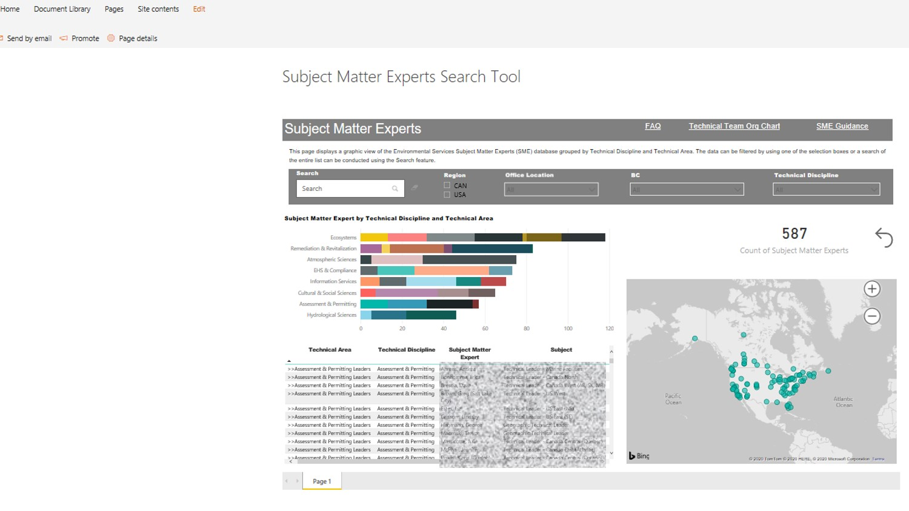

```{r setup, include=FALSE}
knitr::opts_chunk$set(echo = FALSE,warning = FALSE,error = F,message = F)
library(tidyverse)
library(plotly)
library(kableExtra)
library(leaflet)
library(data.table)
options(scipen = 6)

```

<hr/>
Below are some examples of the tools I use on projects for data analysis, visualization, and making repetitive or tedious tasks more efficient.


# Web Applications with Shiny
Try my R Shiny App for exploring environmental datasets. Follow the link, hit the "Load Demo Data" button, pick a few locations and analytes from the left side, and explore the demo data.

[My Demo Data Explorer App](https://peernisse.shinyapps.io/wqdashboard/)
<hr/>


# Data Tables
Automate report results tables and formatting.
<div class="row">
<div class="column">
</img>
</div>
<div class="column"></div>
</img>
</div>

#Data-Linked Excel Tools
Most of us use Excel extensively. Modern Excel has lots of data source options such as Access databases, SQL Server, SharePoint lists, Oracle databases...

This makes it convenient to build analysis dashboards and tools right in Excel, with the data linked from a project database or other source.

### A simple Water Level Transducer Project with Access and Excel
Data are maintained in Access with automated import of new monthly data files. 
</img>

Data visualization and analysis features are built in Excel, always up to date with the linked Access database.
</img>


# Visualizations
Any common analytic visualizations can be created as images or PDF files, for insertion into a presentation, a document or to put in an appendix.

Any kind of plots, too many to show. Histograms, scatter plots, bar charts, box plots, piper diagrams, stiff plots, heat maps, contour maps, bi plots, pies, control charts, radial charts, bubble....

### Box or Violin Density Compares Variables between Groups

```{r}
df<-iris %>%
  gather(Parameter,Value,1:4)

ggplot(df,aes(Species,Value,fill=Species))+
  geom_jitter(alpha=.5)+
  geom_violin(alpha=.5)+
  facet_wrap(~Parameter)+
  theme(legend.position='bottom',legend.title=element_blank(),
        strip.background = element_rect(fill='wheat'))+
  labs(y="Dimension (cm)",title="Violin Density Plot, Sepal and Petal Morphology\nin Three Iris Species")

```

### Time Series/Grouped Time Series Depict Change through Time
**GoldSim model output for two modeling scenarios, over the three expected phases of mine operation.**
</img>

**A look at molybdenum concentration behavior by season.**
</img>


### Regression reveals Correlation between two Variables
**Marine mussels tissue contaminant as a function of distance from the source.**

</img>

**A look at arsenic's correlation with several other variables.**
</img>


<hr/>
# Interactive Visualizations
Interactive visualizations can be presented in PowerPoint, HTML files, or in HTML slide presentations, allowing the user or presenter to interact with the data in real time.

### An Interactive Time Series of COVID-19 Data in the US
Hover the plot to activate the toolbar, filter the data by double-clicking in the legend to select a location,and using the Ctrl key + click to select multiple locations to compare.

```{r intplots}

conData<-fread('https://raw.githubusercontent.com/CSSEGISandData/COVID-19/master/csse_covid_19_data/csse_covid_19_time_series/time_series_covid19_confirmed_US.csv')

dData<-fread('https://raw.githubusercontent.com/CSSEGISandData/COVID-19/master/csse_covid_19_data/csse_covid_19_time_series/time_series_covid19_deaths_US.csv')

cdata<-conData %>% 
  select(7:ncol(.)) %>% 
  gather(Date,Result,8:ncol(.)) %>% 
  mutate(Parameter = 'Confirmed Cases')

ddata<-dData %>% 
  select(7:ncol(.)) %>% 
  gather(Date,Result,8:ncol(.)) %>% 
  mutate(Parameter = 'Deaths')

gdata<-bind_rows(cdata,ddata) %>% 
  mutate(Date = as.Date(Date,format='%m/%d/%y')) %>% 
  group_by(Parameter,Province_State,Date) %>% 
  summarize(Result = sum(Result)) %>% 
  arrange(Parameter,Province_State,Date) %>% 
  as.data.frame(.) %>% 
  filter(#Parameter=='Confirmed Cases',
         Result>0 & Result != '')

n<-length(unique(gdata$Province_State))

g<-ggplot(gdata,aes(Date,Result,color=Province_State))+
  theme(plot.margin = margin(0.5,0.1,0.1,0.1,unit = 'in'))+
  geom_line()+
  theme(legend.position='None')+
  #scale_color_manual(values = rep('grey',n))+
  facet_wrap(~Parameter,scales='free')+
  labs(y='# of Cases',title = 'COVID-19 Cases through Time by State/Province')

ggplotly(g,width=800,height=500) %>% 
  layout(hoverlabel=list(bgcolor="red")) %>% 
  highlight(on = "plotly_hover")

```

*Data Source: *https://github.com/CSSEGISandData/COVID-19

### An Interactive 3D Plot

Hover the plot to use the toolbars and move the plot around.


```{r 3d}
#Test 3d graphic

set.seed(42)
temp<-rnorm(100,mean = 30, sd = 5)
pressure<-rnorm(100)
time<-1:100

plot_ly(x = temp,y = pressure, z = time, type = "scatter3d",
        mode = 'markers', color = temp)


```


### 3D Surface

Hover the plot to use the toolbars and move the plot around.


```{r hm2}
z <- c(
  c(8.83,8.89,8.81,8.87,8.9,8.87),
  c(8.89,8.94,8.85,8.94,8.96,8.92),
  c(8.84,8.9,8.82,8.92,8.93,8.91),
  c(8.79,8.85,8.79,8.9,8.94,8.92),
  c(8.79,8.88,8.81,8.9,8.95,8.92),
  c(8.8,8.82,8.78,8.91,8.94,8.92),
  c(8.75,8.78,8.77,8.91,8.95,8.92),
  c(8.8,8.8,8.77,8.91,8.95,8.94),
  c(8.74,8.81,8.76,8.93,8.98,8.99),
  c(8.89,8.99,8.92,9.1,9.13,9.11),
  c(8.97,8.97,8.91,9.09,9.11,9.11),
  c(9.04,9.08,9.05,9.25,9.28,9.27),
  c(9,9.01,9,9.2,9.23,9.2),
  c(8.99,8.99,8.98,9.18,9.2,9.19),
  c(8.93,8.97,8.97,9.18,9.2,9.18)
)
dim(z) <- c(15,6)
z2 <- z + 1
z3 <- z - 1

fig <- plot_ly(showscale = FALSE)
fig <- fig %>% add_surface(z = ~z)
fig <- fig %>% add_surface(z = ~z2, opacity = 0.98)
fig <- fig %>% add_surface(z = ~z3, opacity = 0.98)

fig


```


<hr/>
# Automated Reporting
Template reports, including boilerplate text, tables and graphs. The report is generated from a data source, so periodic reporting such as monthly reports are updated each month with the new data. Inline text and calculations also can be programmed to change with the data.

Can be output to Word (static) or HTML (interactive) with formatting already applied.

</img>

<hr/>

# SharePoint Customization
SharePoint O365 and Groups sites have great out of the box customization features.
It is also possible to integrate PowerBI reports and dashboards into SharePoint sites.

</img>


